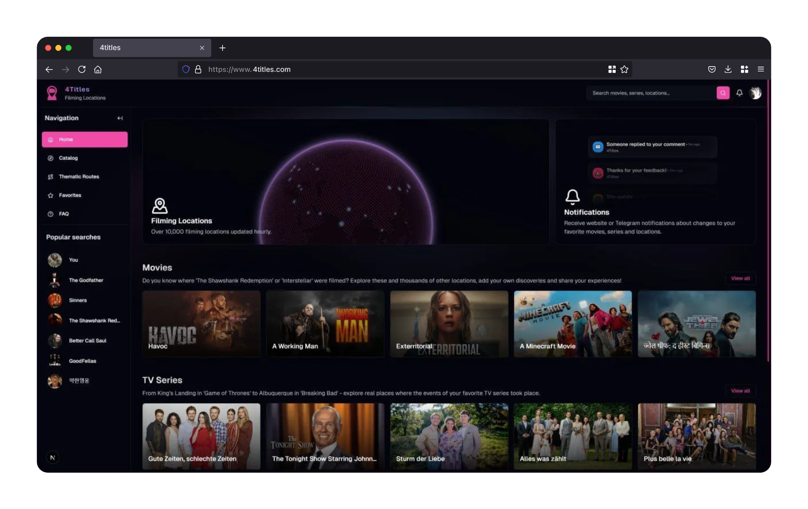

<h1 align="center">4Titles</h1>

<p align="center">A catalog of where movies and TV shows were filmed, with comments, favorites, collections, and user-submitted location proposals.</p>

<p align="center">
  
</p>

---

A pet project. Three former repos (client, server) merged here as an archive - application code only; the deployment side (Docker Compose, Nginx, ELK) isn't included.

## Stack

### Frontend (`client/`)

Next.js 15 on App Router, React 19, TypeScript. Tailwind with shadcn-style components on Radix. Apollo Client with codegen. MapTiler on top of MapLibre GL. `next-intl` for ru/en. PWA via `@ducanh2912/next-pwa`.

### Backend (`server/`)

NestJS 10 on Fastify. GraphQL code-first via Apollo. Drizzle ORM on Postgres 14 + PostGIS. Redis for sessions and cache, BullMQ for queues, Elasticsearch 8.12 for search and logs, MinIO for files, Puppeteer 23 for IMDb scraping (Chrome is in the Docker image), DeepSeek via OpenRouter for LLM enrichment. Argon2 + TOTP for auth. Telegram bot via `nestjs-telegraf`. Resend SMTP with a Courier fallback. Winston -> Logstash for ELK.

## Content sync

Catalog data is pulled in from external sources through three BullMQ queues:

| Queue                             | Concurrency | Rate limit |
| --------------------------------- | ----------- | ---------- |
| `title-sync`                      | 8           | 4 req/s    |
| `title-location-sync`             | 4           | 2 req/s    |
| `title-location-description-sync` | 2           | 1 req/s    |

_Numbers above were sized for a single dev machine, not production._

`title-sync` walks TMDb category by category. For each page it records the seen tmdbIds in a Redis active-set, enqueues one job per title (capped at 35 per category), and recursively schedules the next page after a one-second delay. When a category finishes, anything in the DB that wasn't in the new active-set is moved to a `REGULAR` bucket - nothing gets deleted, popularity churn moves titles between categories.

For each title, the worker fetches the detail record from TMDb (with `external_ids` to find the IMDb id), creates or updates the row with its relations, and refreshes the Elasticsearch document. If an IMDb id is present, a location job is enqueued.

`title-location-sync` scrapes IMDb's locations page through Puppeteer. The parser maintains a browser pool sized `[min, max]`, each instance tracking concurrent pages, error count, and idle time; an instance is replaced after more than two errors or thirty minutes idle. A request interceptor aborts images, stylesheets, fonts, and media. The "See more" button is clicked up to five times until the card count stops growing.

Raw addresses go through Geoapify, are deduped by `placeId`, and land as `point(xy)` rows with an FK to `countries` and a row in the M:N join. New locations without descriptions trigger a description job.

`title-location-description-sync` asks DeepSeek (via OpenRouter, using the `openai` SDK with an overridden `baseURL`) for a short paragraph per supported language. There's a pool of up to 16 keys (`OPEN_ROUTER_API_KEY` and `_1..15`), each with its own state: a 429 parks the key with exponential backoff (60 s → 1 h cap) and tries the next, a 401 blocks it permanently. A sliding-window rate limiter (10 req / 10 s) gates each call. After at least one language succeeds, the description rows are written and the title is reindexed.

BullMQ job ids do the deduplication: `category-${cat}-page-${n}`, `title-${type}-${tmdbId}`, `location-${titleId}`. Re-enqueueing the same job in flight is a no-op. Retries are `attempts: 3` with exponential backoff.

## Auth

Sessions live in Redis (the cookie carries only a session ID), no JWTs. Argon2 for passwords. TOTP 2FA, verified as a separate login step when enabled. RBAC via `nest-access-control` with three roles (USER / MODERATOR / ADMIN) and a static policy.

## Data and GraphQL

About 30 tables. Coordinates use the native Postgres `point` type. Comments, favorites, and collection items are polymorphic - each row carries a `*_type` enum discriminator pointing at titles, locations, or collections.

The GraphQL surface is about 130 endpoints across 21 resolvers, schema generated code-first. Uploads go through `mercurius-upload` with `graphql-upload` providing the scalar. No federation, no subscriptions.

## Moderation

Text goes through `@2toad/profanity` (ru / en / fr) on signup usernames, comments, and feedback. Images go through `sharp` to 224×224, then `nsfwjs` on `@tensorflow/tfjs-node` with per-category thresholds.

## Telegram bot

Built on `nestjs-telegraf`. Account linking through signed deeplink tokens, a feedback wizard with per-chat state, outbound notifications (password reset, deactivation, new follower), and forwarding of `fatal` / `warn` log records to a channel.

## Frontend specifics

Pages use a hybrid SSR + Apollo strategy: `page.tsx` files call the GraphQL server with a plain `fetch(SERVER_URL)` plus `next: { revalidate: N }` for ISR (no Apollo on the server); the same documents drive client-side Apollo for infinite scroll and cache writes.

Theming is two-layered - light / dark via `next-themes`, multiplied by eight accent colors. Accents are CSS variables on `.theme-*` classes; map cluster colors hang off the same variables and follow the active accent.

PWA via Workbox with `StaleWhileRevalidate` for static assets and `NetworkFirst` for HTML.

## Layout

```
4titles/
├── client/    Next.js app
├── server/    NestJS backend; sync algorithm in src/modules/content/title/services/sync/
└── .github/
```

The client side's map wrapper around MapTiler lives in `client/src/components/ui/elements/map/`, split into hooks for clustering, routing, geocoding, marker focus, globe-projection error handling, language detection, and location search.
